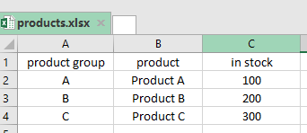

# Hanamo Stock Management System

## Instructions

1. Follow the requirements as detailed below
2. It is not required for you to finish all the parts.
3. From a fork of this exact same repo, send a link of your work to info@webuffsolutions.com . (If you dont have a github account, it has to be created)

## Requirements:
  -Ability to login as admin / stock master

  ### Admin Account:
  -CRUD functionality (Create/ Read / Update / Delete) for: users / product_groups / products

  ### Stock Master:
  -Ability to view all products
  -Ability to add/less product stocks

  Users:
  - admin (email: admin@gmail.com | password: p@ssw^rd)
  - stock master (email: stock_master@gmail.com | password: p@ssw^rd)

  Roles:
  - admin | stock master

  Tables:
  - product_groups ( id | name )
  - products ( id | product_group_id | name )
  - inventory ( id | product_id | in_stock )
  - users ( id | role_id | name | email | password )
  - roles ( id | name )

## Rules:
- Use Laravel make:auth as default Bootstrap-based design theme (Required)
- Use Laravel’s validation function, using Request classes
- Use basic Laravel resource controllers with default methods – index, create, store etc.
- Batch Import/Export using Laravel Excel (Required)

## Sample Excel Format:

## Pointers:
- Clearly written code is a big plus
- Bonus: Ajax Implementation, TDD, Repository Pattern, Us e of other frontend frameworks like semantic-ui, bulma-css, materialize css, etc
- Put comments on your code
